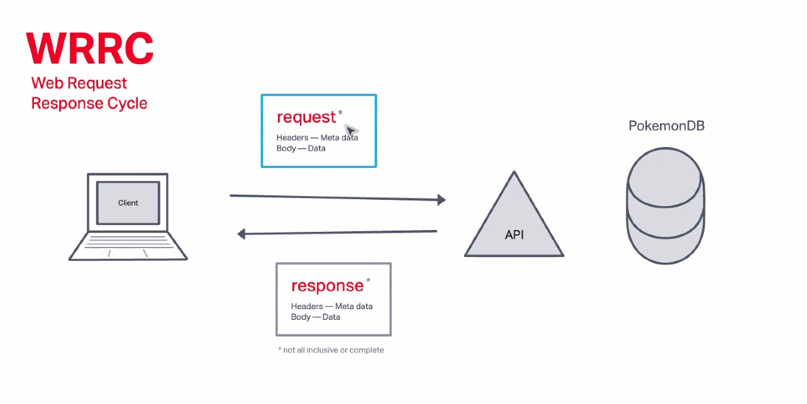

# City Explorer

**Author**: Zeegii Ulziibaatar
**Version**: 1.0.0 (increment the patch/fix version number if you make more commits past your first submission)

## Overview

This application will offer you the exact longitude and lattitude of the location you're loking for.

## Getting Started

  1. I will create repo in Github and local machine.
  2. Run the React app.
  3. Create env file, and ignore it before I push it to the github.
  4. Code, and ACP.

## Architecture

I will use React library to make this website. 

## Change Log

05-03-2023 1:00 pm - Created the environment. Initialized the git. 
<!-- 01-01-2001 4:59pm - Application now has a fully-functional express server, with a GET route for the location resource. -->

## Credit and Collaborations
<!-- Give credit (and a link) to other people or resources that helped you build this application. -->
Time Estimates
For each of the lab features, make an estimate of the time it will take you to complete the feature, and record your start and finish times for that feature:

Name of feature: Starting the app.

Estimate of time needed to complete: 05/03/2023 3:00pm

Start time: 05/03/2023 12:30pm

Finish time: 05/04/2023 09:00pm

Actual time needed to complete: 6 hours;

### Web Response

;
